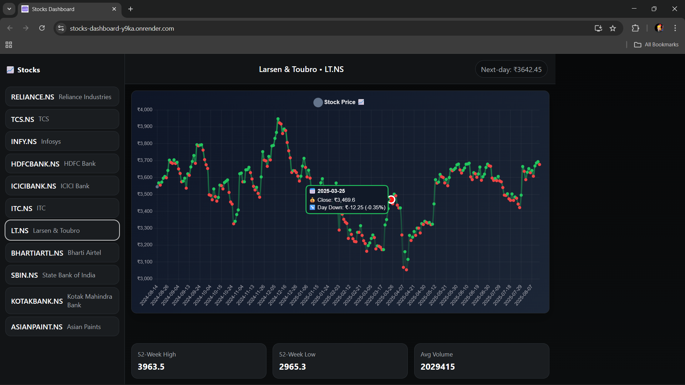
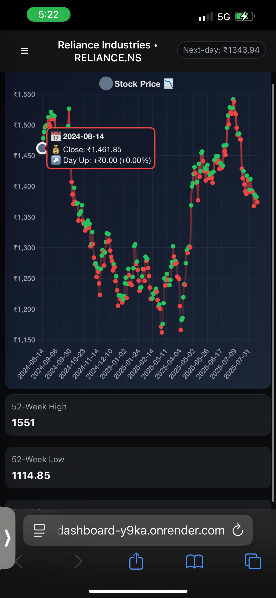
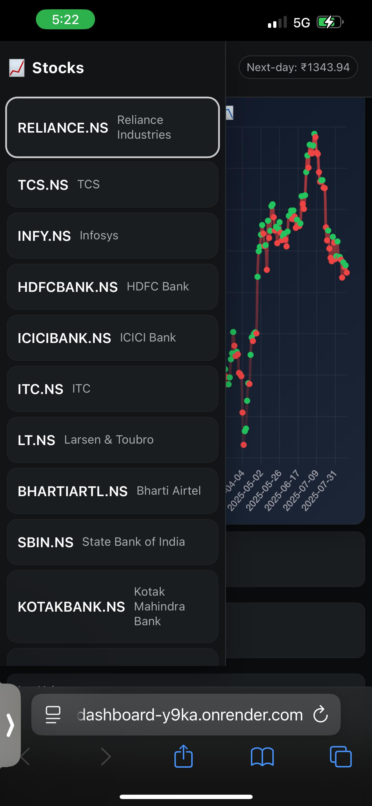

# 📈 Stock Trading Dashboard

A modern, full-stack stock trading dashboard that provides real-time stock data, price predictions, and comprehensive analytics for Indian stock market (NSE) companies. Built with React frontend and FastAPI backend, featuring a beautiful dark theme and mobile-responsive design.

## 📸 Screenshots

### Desktop View

*Full desktop experience with sidebar navigation and comprehensive charts*

### Mobile Views
<div align="center">
  
  &nbsp;&nbsp;&nbsp;&nbsp;
  
</div>
*Left: Mobile dashboard with responsive design | Right: Mobile hamburger menu expanded*

</div>

## 🚀 Live Demo

- **Frontend**: [https://stocks-dashboard-y9ka.onrender.com)](https://stocks-dashboard-y9ka.onrender.com)
- **Backend API**: [https://stocks-api-backend.onrender.com](https://stocks-api-backend.onrender.com)

## 💡 Development Approach & Challenges

### **Development Philosophy**
This project was built with a **mobile-first, user-centric approach**, prioritizing performance and accessibility. The development followed a **full-stack architecture** with clear separation of concerns - a robust FastAPI backend handling data processing and machine learning, paired with a responsive React frontend focused on user experience.

The **iterative development process** started with core functionality (stock data fetching), then progressively enhanced with predictive analytics, mobile responsiveness, and production deployment. **Component-based architecture** in React ensured maintainable and reusable code, while FastAPI's automatic documentation and type hints accelerated backend development.

### **Key Technologies & Rationale**
- **FastAPI** was chosen for its high performance, automatic API documentation, and excellent Python ecosystem integration
- **React with modern hooks** provided a clean, maintainable frontend architecture
- **Chart.js** offered rich, interactive visualizations perfect for financial data
- **yfinance** provided reliable access to Yahoo Finance data for Indian stocks
- **Render deployment** ensured scalable, production-ready hosting with continuous deployment

### **Major Challenges Overcome**

**1. yfinance API Latency & Reliability**
The biggest challenge was handling yfinance's unpredictable response times and occasional rate limiting. Implemented comprehensive retry logic, error handling, and fallback mechanisms to ensure consistent data availability even during API slowdowns.

**2. Responsive Chart.js Design**
Making Chart.js fully responsive across devices required extensive customization. Challenges included adjusting chart point sizes for mobile touch interaction, implementing dynamic color schemes for the dark theme, and ensuring proper canvas scaling on different screen densities and orientations.

**3. Mobile Safari Viewport Issues**
iOS Safari's dynamic toolbar behavior caused content to be hidden behind browser UI elements. Solved using CSS safe area insets, dynamic viewport units, and custom scrolling implementations for seamless mobile experience.

**4. Real-time Data Synchronization**
Coordinating multiple API calls for prices, statistics, and predictions while maintaining UI responsiveness required careful Promise management and loading state optimization.

## ✨ Features

### 📊 **Real-time Stock Data**
- Live stock prices for 11 major NSE companies
- Historical price data with interactive charts
- 1-year historical data with daily intervals

### 📈 **Stock Analytics**
- **52-week high/low** tracking
- **Average daily volume** analysis
- **Price volatility** calculations
- **Daily price changes** monitoring

### 🔮 **AI-Powered Predictions**
- Next-day closing price predictions
- Linear regression and SMA-based models
- Prediction confidence and methodology display

### 📱 **Mobile-First Design**
- Fully responsive design for all devices
- Touch-friendly hamburger menu for mobile
- Optimized for iOS Safari with safe area support
- Smooth scrolling and touch interactions

### 🎨 **Beautiful UI/UX**
- Modern dark theme with gradient backgrounds
- Smooth animations and transitions
- Interactive stock charts with Chart.js
- Clean, professional interface

## 🛠️ Technologies Used

### **Frontend**
- **React** - Modern UI library
- **Chart.js & React-Chartjs-2** - Interactive stock charts
- **CSS Grid & Flexbox** - Responsive layouts
- **Modern CSS** - Custom properties, safe area insets

### **Backend**
- **FastAPI** - High-performance Python web framework
- **yfinance** - Real-time stock data from Yahoo Finance
- **pandas & numpy** - Data processing and analysis
- **scikit-learn** - Machine learning for price predictions
- **CORS middleware** - Cross-origin resource sharing

### **Deployment**
- **Render** - Cloud hosting platform
- **GitHub** - Version control and continuous deployment
- **Environment Variables** - Secure configuration management

## 📦 Installation & Setup

### **Prerequisites**
- Node.js 16+ and npm
- Python 3.9+
- Git

### **1. Clone the Repository**
```
git clone https://github.com/your-username/stocks-dashboard.git
cd stocks-dashboard
```

### **2. Backend Setup**
```
cd backend

# Create virtual environment
python -m venv venv
source venv/bin/activate  # On Windows: venv\Scripts\activate

# Install dependencies
pip install -r requirements.txt

# Run development server
uvicorn app:app --reload --host 0.0.0.0 --port 8000
```

### **3. Frontend Setup**
```
cd fronted  # Note: folder name is 'fronted'

# Install dependencies
npm install

# Create environment file
echo "REACT_APP_API_URL=http://localhost:8000" > .env

# Run development server
npm start
```

### **4. Access the Application**
- Frontend: [http://localhost:3000](http://localhost:3000)
- Backend API: [http://localhost:8000](http://localhost:8000)
- API Documentation: [http://localhost:8000/docs](http://localhost:8000/docs)

## 🏗️ Project Structure

```
stocks-dashboard/
├── backend/
│   ├── app.py                 # Main FastAPI application
│   ├── requirements.txt       # Python dependencies
│   └── ...
├── fronted/                   # React frontend (note: 'fronted')
│   ├── src/
│   │   ├── App.js            # Main React component
│   │   ├── App.css           # Styling and responsive design
│   │   ├── config.js         # API configuration
│   │   └── components/
│   │       ├── CompanyList.js    # Stock company selector
│   │       ├── StockChart.js     # Interactive price charts
│   │       └── StatsPanel.js     # Stock statistics display
│   ├── public/
│   ├── package.json
│   └── ...
└── README.md
```

## 🔗 API Endpoints

### **Core Endpoints**
- `GET /` - API information and health check
- `GET /companies` - List of available stock companies
- `GET /prices/{symbol}` - Historical stock prices
- `GET /stats/{symbol}` - Stock statistics and analytics
- `GET /predict/{symbol}` - Next-day price predictions
- `GET /health` - Health check endpoint

### **Example API Usage**
```
# Get company list
curl https://stocks-api-backend.onrender.com/companies

# Get Reliance stock prices
curl https://stocks-api-backend.onrender.com/prices/RELIANCE.NS

# Get TCS statistics
curl https://stocks-api-backend.onrender.com/stats/TCS.NS

# Get Infosys price prediction
curl https://stocks-api-backend.onrender.com/predict/INFY.NS
```

## 📊 Supported Stocks

The dashboard currently supports 11 major NSE companies:

| Symbol | Company Name |
|--------|-------------|
| RELIANCE.NS | Reliance Industries |
| TCS.NS | Tata Consultancy Services |
| INFY.NS | Infosys |
| HDFCBANK.NS | HDFC Bank |
| ICICIBANK.NS | ICICI Bank |
| ITC.NS | ITC Limited |
| LT.NS | Larsen & Toubro |
| BHARTIARTL.NS | Bharti Airtel |
| SBIN.NS | State Bank of India |
| KOTAKBANK.NS | Kotak Mahindra Bank |
| ASIANPAINT.NS | Asian Paints |

## 🚀 Deployment

The application is deployed on **Render** with separate services for frontend and backend:

### **Backend Deployment**
- **Build Command**: `pip install -r requirements.txt`
- **Start Command**: `uvicorn app:app --host 0.0.0.0 --port $PORT`
- **Root Directory**: `backend`

### **Frontend Deployment**
- **Build Command**: `npm install && npm run build`
- **Publish Directory**: `build`
- **Root Directory**: `fronted`
- **Environment Variable**: `REACT_APP_API_URL`

## 📱 Mobile Features

- **Hamburger Menu**: Touch-friendly navigation for mobile devices
- **Responsive Charts**: Charts adapt to different screen sizes
- **Touch Optimization**: Large touch targets and smooth scrolling
- **Safari Support**: Optimized for iOS Safari with safe area insets
- **Progressive Enhancement**: Works across all modern browsers

## 🔧 Configuration

### **Environment Variables**

**Frontend (.env)**
```
REACT_APP_API_URL=https://stocks-api-backend.onrender.com
```

**Backend (Render Environment)**
```
PORT=8000  # Automatically set by Render
```

## 🤝 Contributing

1. Fork the repository
2. Create a feature branch (`git checkout -b feature/amazing-feature`)
3. Commit your changes (`git commit -m 'Add amazing feature'`)
4. Push to the branch (`git push origin feature/amazing-feature`)
5. Open a Pull Request

## 📞 Support

If you encounter any issues or have questions:
- Open an issue on GitHub
- Check the API documentation at `/docs` endpoint
- Review the browser console for debugging information
